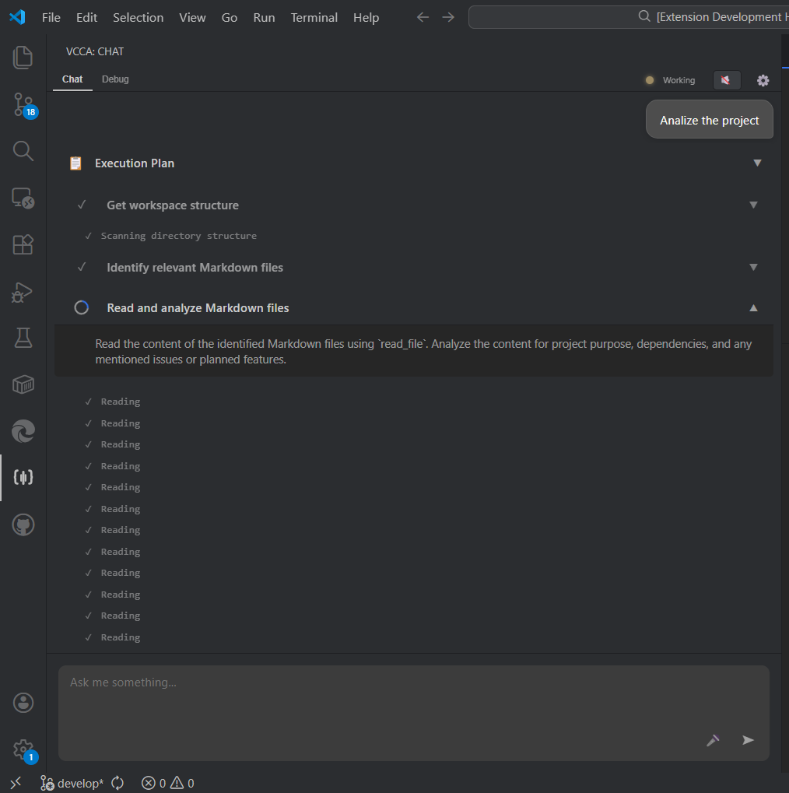
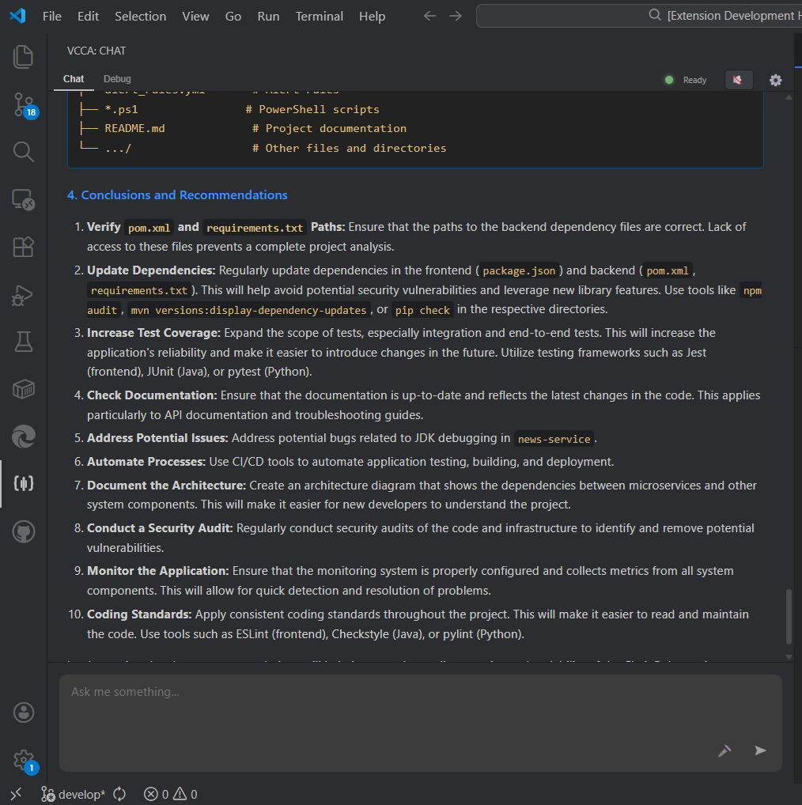

# 🎙️ AI Voice-Controlled Coding Agent (VCCA)

**Your intelligent, voice-activated pair programmer inside VS Code.**

VCCA is not just a chat window—it's an autonomous coding agent capable of planning, executing, and reporting on complex development tasks, all controlled by your voice.

## 🚀 Key Features

### 🗣️ True Voice Control
Forget typing long prompts. Just speak naturally. VCCA uses local **Whisper** models for fast, private accurate speech-to-text and **Silero VAD** for natural turn-taking.
> "Analyze this project and tell me how the authentication flow works."

### 🧠 Structured Planning & Reasoning
Unlike simple autocomplete interacting with VCCA feels like working with a senior engineer. The agent:
1.  **Analyzes** your request.
2.  **Creates a Step-by-Step Plan** before touching any code.
3.  **Executes** each step autonomously.
4.  **Self-Corrects** if it encounters errors.

### 🛠️ Deep Workspace Integration
The agent has full access to specific tools to interact with your codebase:
*   📂 **File Operations**: Read, Write, Diff, List directories.
*   🔍 **Analysis**: Search text, Find references, Outline symbols.
*   💻 **Terminal**: Execute shell commands and read outputs.
*   ⚙️ **VS Code API**: Open files, change settings, highlight lines.

### 📊 Comprehensive Reporting
After completing a task, VCCA doesn't just say "Done". It generates a detailed **Markdown Report** summarizing:
*   Goals achieved.
*   Key findings (with tables and lists).
*   Architecture insights.
*   Recommendations for next steps.

## 💡 Use Cases

*   **Project Onboarding**: "Explain the architecture of this repo and list key dependencies."
*   **Refactoring**: "Move the `AuthService` to a new module and update all imports."
*   **Debugging**: "Run the tests, find why the login test is failing, and propose a fix."
*   **Documentation**: "Generate docstrings for all functions in `utils.py` following Google style."

## 🔧 Architecture

VCCA operates on a Client-Server model for maximum performance:
*   **Backend**: Python-based brain running **Gemini 2.0**, managing state, audio processing, and tool execution.
*   **Frontend**: Native VS Code Webview with a reactive Timeline UI that visualizes the agent's thought process in real-time.

