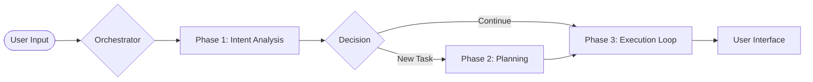
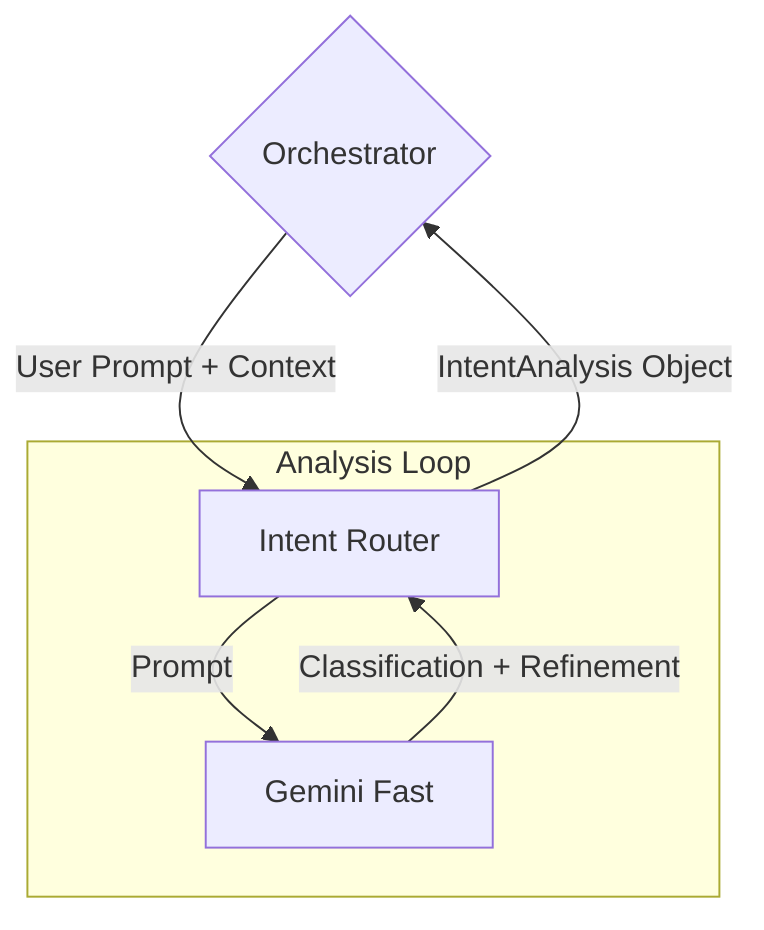
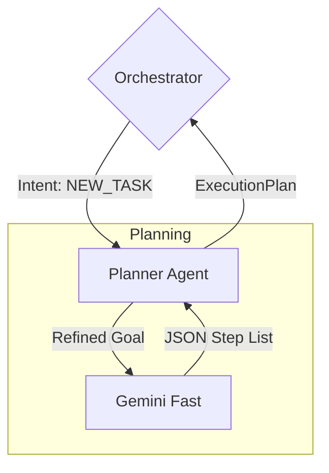
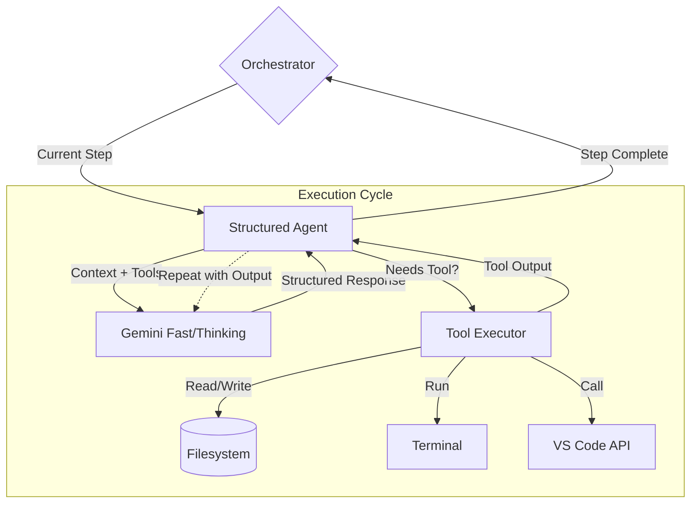

# Agent Prompt Handling & LLM Connection Schema

This document outlines the architecture of how the VCCA agent processes user prompts and interacts with the Large Language Model (Google Gemini).

## 1. High-Level Workflow

The agent operates in three main phases managed by the `Orchestrator`.

---

## 2. Phase 1: Intent Analysis Details

**Component:** `IntentRouter` (`backend/src/agent/intent_router.py`)

This phase determines *what* the user wants (e.g., start a new task, modify a plan, just chat) and refines the prompt by resolving context (e.g., "this file" -> "src/main.py").

*   **Inputs:** Raw user text, Conversation History, Current Plan.
*   **Outputs:** `IntentAnalysis` (Intent type, Refined Prompt, Resolved References).
*   **LLM Model:** Uses a fast model (e.g., Gemini Flash) for low latency.

---

## 3. Phase 2: Planning Details

**Component:** `PlannerAgent` (`backend/src/agent/planner.py`)

If a new task is requested, this phase breaks it down into a list of executable steps.

*   **Inputs:** Refined technical prompt from Phase 1.
*   **Outputs:** `ExecutionPlan` (list of `TaskStep` items).
*   **Key Logic:** Generates distinct steps (e.g., "Read file", "Modify code", "Run tests") that can be executed sequentially.

---

## 4. Phase 3: Execution Loop Details

**Component:** `StructuredAgent` (`backend/src/agent/structured_agent.py`)

This is the main "coding" phase where tools are used to modify the workspace.

*   **Inputs:** Validated `TaskStep`.
*   **Protocol:** Uses a structured JSON protocol. The LLM returns a JSON object requesting tool calls or providing a final answer.
*   **Loop:** The agent autonomously loops (Thought -> Tool Call -> Tool Output -> Thought) until the step object is satisfied.

---

## 5. LLM Connection Configuration

The connection to the LLM is handled via `pydantic_ai` and `google-generativeai`.

*   **Configuration**: `backend/src/config.py` loads API keys.
*   **Providers**: Currently supports Google Gemini.
*   **Models**:
    *   **Fast**: Used for routing, planning, and simple edits.
    *   **Thinking**: (Optional) Used for complex logic/refactoring during execution.
