# Agent Workflow & Architecture

This document describes the workflow of the **Structured Agent** architecture used in VCCA (Voice-Controlled Coding Agent). The system has evolved from a simple loop to a sophisticated three-stage pipeline managed by an Orchestrator.

## High-Level Architecture (Structured Agent)

The backend logic is now split into specialized components to handle complex coding tasks more reliability:

1.  **Intent Router**: Classifies the user request (e.g., `new_task`, `follow_up`, `clarification`).
2.  **Planner**: Analyzing the request and generating a step-by-step Execution Plan.
3.  **Orchestrator**: Manages the state, executes the plan step-by-step, and handles error recovery.
4.  **Executor Agent**: A specialized LLM worker that performs the actions defined in a single step using available tools.

## Workflow Visualization

```mermaid
sequenceDiagram
    participant User
    participant UI as VS Code UI
    participant WS as WebSocket API
    participant Orch as Orchestrator
    participant Plan as Planner
    participant Exec as Executor Agent

    User->>UI: "Analyze this project"
    UI->>WS: Audio/Text Input
    WS->>Orch: New Request
    
    rect rgb(240, 248, 255)
        Note right of Orch: Phase 1: Planning
        Orch->>Plan: Generate Plan
        Plan->>Plan: Analyze Context (File Tree, Readme)
        Plan-->>Orch: JSON Plan (e.g. 5 steps)
        Orch->>WS: {"type": "plan_created", ...}
        WS->>UI: Show Collapsed Plan in Chat
    end

    rect rgb(255, 250, 240)
        Note right of Orch: Phase 2: Execution Loop
        loop For each Step in Plan
            Orch->>WS: {"type": "step_start", ...}
            WS->>UI: Show Spinner for Step
            
            Orch->>Exec: Execute Step Prompt
            
            loop Tool Usage
                Exec->>Exec: Think...
                Exec->>Orch: Tool Call (read_file)
                Orch->>WS: {"type": "agent_action", "status": "running"}
                WS->>UI: Show Tool Trace
                
                Orch->>System: Execute Tool (File/Terminal)
                System-->>Orch: Tool Result
                
                Orch->>WS: {"type": "agent_action", "status": "success"}
                WS->>UI: Update Tool Trace
            end
            
            Exec-->>Orch: Step Result (Summary)
            Orch->>WS: {"type": "step_complete", ...}
            WS->>UI: Mark Step Done (Checkmark)
        end
    end

    rect rgb(240, 255, 240)
        Note right of Orch: Phase 3: Reporting
        Orch->>Exec: Generate Final Report
        Exec-->>Orch: Stream Markdown Report
        Orch->>WS: Stream Chat Response
        WS->>UI: Display Report
    end
```



## Component Details

### 1. Intent Router
Determines if the user's input is:
- A new task requiring a plan.
- A modification to the current plan.
- A simple chat/question.
- A confirmation/approval.

### 2. Planner Agent
- **Role:** Architect.
- **Output:** Strict JSON structure containing `refined_goal` and a list of `steps`.
- **Capabilities:** Can "fast access" read-only tools (like `get_workspace_structure` or `read_file`) during planning to create accurate plans.
- **Protocol:** ALWAYS creates a final step "Final Summary/Report" for complex tasks.

### 3. Orchestrator
- **Role:** Project Manager.
- **Responsibilities:**
    - Maintains the Session State (current plan, executed steps, history).
    - Broadcasts updates to the UI via WebSocket callbacks.
    - Persists state to disk (`.vcca/.cache/`) for reliability.
    - Handles "Silent Execution" - intermediate tool outputs aren't spammed to the main chat, only visible as "traces" in the UI timeline.

### 4. Executor Agent
- **Role:** Worker.
- **Responsibilities:**
    - Receives a specific task for *one step*.
    - Has access to all editing and analysis tools.
    - Returns a concise summary of what it did.

## UI Representation (Frontend)

The Frontend (React Webview) uses a **Timeline** metaphor to visualise this process:

1.  **Plan Container:** A collapsible block showing the Goal and all Steps.
2.  **Step Container:** Individual blocks for each step.
    *   **State:** `pending` (gray), `in_progress` (blue border + spinner), `done` (subtle opacity + checkmark).
    *   **Body:** Expands to show the detailed description of the step.
3.  **Tool Traces:** Small, compact lines appearing *inside* the active step container, showing real-time tool usage (e.g., `read_file`, `run_terminal_command`).
4.  **Final Report:** Standard markdown chat message appearing at the very end.

## Communication Protocol (WebSocket)

Updated message types for the structured workflow:

*   **`plan_created`**: Sends the full plan object.
*   **`step_start`**: Signals the start of a step (ID, Title).
*   **`agent_action`**: Signals tool start/end (for timeline traces).
*   **`step_complete`**: Signals step completion and carries the result.
*   **`chat_stream`**: Standard text streaming (used mostly for the final report).
    participant WS as WebSocket Router
    participant UI as React Webview
    participant VS as VS Code Extension Host

    Agent->>Adapter: read_file("main.py")
    activate Adapter
    Note right of Adapter: Create Future & Call ID
    Adapter->>WS: send(ToolUsageMessage)
    WS->>UI: {"type": "tool_usage", "call_id": "123", "tool": "read_file", ...}
    
    UI->>VS: vscode.postMessage(msg)
    activate VS
    VS->>VS: vscode.workspace.fs.readFile(...)
    VS-->>UI: Result Content (String)
    deactivate VS
    
    UI->>WS: {"type": "tool_result", "call_id": "123", "output": "..."}
    WS->>Adapter: handle_tool_result("123", "...")
    Adapter-->>Agent: Returns Content
    deactivate Adapter
    
    Agent->>Agent: Continue Thinking...
```

#### Supported Tools
*   `read_file`: Reads content of a file from the workspace.
*   `write_file`: Writes content to a file (creates if missing).
*   `list_dir`: Lists files/folders in a directory.
*   `get_visible_range`: Returns the lines currently visible in the active editor (useful for context).
*   `run_terminal`: Executes a shell command in the integrated terminal.

### 6. Response & TTS
*   **Synthesis:** Once the agent completes its thought, the full text is sent to `TTSProcessor`.
*   **Logic:** `edge-tts` generates an audio stream.
*   **Playback:** `sounddevice` plays the stream directly to the system speakers (avoiding browser policies).

